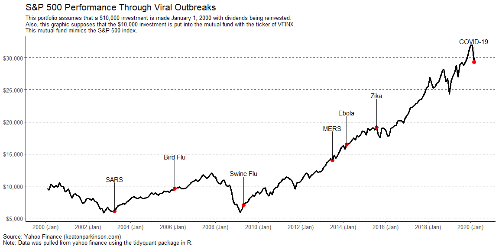

```r
#Libraries used
library(tidyverse)
library(tidyquant) #This package is awesome for finance
library(ggrepel)
```


```r
#Get S&P prices from Yahoo Finance

stock_prices <- c("VFINX") %>%
  tq_get(get  = "stock.prices",
         from = "2000-01-01",
         to   = "2020-03-06")
```


```r
# S&P 500 monthly returns
stock_returns_monthly <- stock_prices %>%
  group_by(symbol) %>%
  tq_transmute(select     = adjusted, 
               mutate_fun = periodReturn, 
               period     = "monthly", 
               col_rename = "Ra")

# wts is short for weights. I want 100% of the weight of my portfolio to be in the S&P 500
wts <- c(1.0)

# This code is used to determine the value of the porfolio at the end of each month
portfolio_growth_monthly <- stock_returns_monthly %>%
  tq_portfolio(assets_col   = symbol, 
               returns_col  = Ra, 
               weights      = wts, 
               col_rename   = "portfolio",
               wealth.index = TRUE) %>%
  mutate(portfolio = portfolio * 10000)


# The new column that has 'My Portfolio' is just used for making the graph easier.
new_portfolio_growth_monthly <- portfolio_growth_monthly %>% 
  mutate(Portfolios = 'My Portfolio') 

# Put the outbreaks on the approximate dates that they started.
outbreaks_data <- new_portfolio_growth_monthly %>% 
  filter(date %in% as.Date(c('2003-03-31', '2006-01-31', 
                             '2009-04-30', '2013-06-28', 
                             '2014-02-28', '2015-07-31', 
                             '2020-02-28'))) %>% 
  mutate(outbreaks = c('SARS', 'Bird Flu', 'Swine Flu', 
                       'MERS', 'Ebola', 'Zika', 'COVID-19'))
```


```r
#Code used to create plot
ggplot() +
  geom_line(new_portfolio_growth_monthly, mapping = aes(x = date, y = portfolio), color = 'black',
            size = 1.1) +
  geom_point(outbreaks_data, mapping = aes(x = date, y = portfolio), color = 'red', size = 3) +
  labs(title = "S&P 500 Performance Through Viral Outbreaks",
       subtitle = "This portfolio assumes that a $10,000 investment is made January 1, 2000 with dividends being reinvested.\nAlso, this graphic supposes that the $10,000 investment is put into the mutual fund with the ticker of VFINX.\nThis mutual fund mimics the S&P 500 index.",
       caption = 'Source: Yahoo Finance (keatonparkinson.com)\nNote: Data was pulled from yahoo finance using the tidyquant package in R.', y = "Portfolio Value") +
  geom_text_repel(outbreaks_data, mapping = aes(x = date, y = portfolio, label = outbreaks), min.segment.length = unit(0, 'lines'), nudge_y = 5000, size = 4) +
  scale_y_continuous(labels = scales::dollar, breaks = c(5000, 10000, 15000, 20000, 25000, 30000)) +
  scale_x_date(breaks = as.Date(c('2000-01-01', '2002-01-01', '2004-01-01', 
                                  '2006-01-01', '2008-01-01', '2010-01-01',
                                  '2012-01-01', '2014-01-01', '2016-01-01',
                                  '2018-01-01', '2020-01-01')), labels = c('2000 (Jan)', '2002 (Jan)',
                                                                           '2004 (Jan)', '2006 (Jan)',
                                                                           '2008 (Jan)', '2010 (Jan)',
                                                                           '2012 (Jan)', '2014 (Jan)',
                                                                           '2016 (Jan)', '2018 (Jan)',
                                                                           '2020 (Jan)')) +
  theme_classic() +
  theme(plot.title = element_text(size = 16),
        plot.subtitle = element_text(size = 10),
        plot.caption = element_text(size = 10, hjust = 0),
        plot.caption.position = 'plot',
        axis.title.y = element_blank(),
        axis.title.x = element_blank(),
        panel.grid.major.x = element_blank() ,
        panel.grid.major.y = element_line(size=.1, color="black", linetype = 'dashed'),
        legend.position = 'none',
        axis.text.x=element_text(size=10),
        axis.text.y=element_text(size=10))
```

<!-- -->
