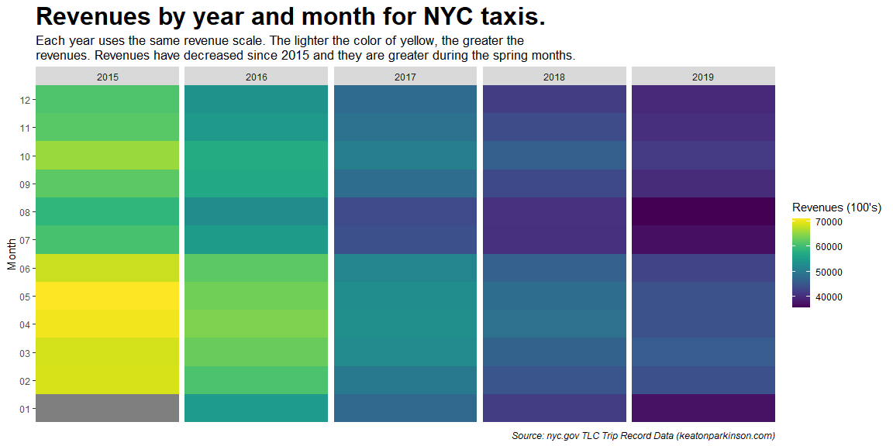

```r
#Libraries Used
library(tidyverse) #Used for the data manipulation and graphing.
library(viridis) #Used for the colors on the graph.
library(naniar) #Used for the replace_with_na function
```


```r
# Read in the dataset
data <- read_csv('taxi_uber_data.csv')

# Taxi data
taxi_data <- data %>% 
  filter(`License Class` %in% c('Yellow', 'Green')) %>% 
  separate(`Month/Year`, into = c('Year', 'Month'), sep = '-') %>% 
  group_by(Year, Month)

# Convert Taxi columns to be in right format
taxi_data$`Farebox Per Day` <- as.numeric(gsub(",", "", taxi_data$`Farebox Per Day`))
taxi_data$`Avg Minutes Per Trip` <- as.numeric(taxi_data$`Avg Minutes Per Trip`)
taxi_data$`Percent of Trips Paid with Credit Card` <- as.numeric(gsub("%", "", taxi_data$`Percent of Trips Paid with Credit Card`))

# Combines green and yellow taxi data and creates there own columns
combined_taxi_data <-  taxi_data %>% 
  mutate(`Vehicle Type` = 'Taxi', ) %>% 
  summarize(farebox_per_day = sum(`Farebox Per Day`), taxi_unique_drivers = sum(`Unique Drivers`), taxi_trips_per_day = sum(`Trips Per Day`),
            taxi_unique_vehicles =  sum(`Unique Vehicles`), taxi_vehicles_per_day = sum(`Vehicles Per Day`), taxi_avg_days_veh_on_road = mean(`Avg Days Vehicles on Road`),
            taxi_avg_hours_per_day_per_vehicle = mean(`Avg Hours Per Day Per Vehicle`), taxi_avg_days_drivers_on_road = mean(`Avg Days Drivers on Road`), 
            taxi_avg_hours_per_day_per_driver = mean(`Avg Hours Per Day Per Driver`), taxi_avg_minutes_per_trip = mean(`Avg Minutes Per Trip`)) 

# Data for heatmaps
taxi <- combined_taxi_data %>% 
  ungroup() %>%
  select(Year, Month, farebox_per_day) %>% 
  add_row(Year = '2015', Month = '01', farebox_per_day = -99) %>% 
  group_by(Year, Month) %>% 
  replace_with_na(replace = list(farebox_per_day = -99))
```


```r
graph <- function(year) {
  returns_yearly <- prices %>%
    group_by(symbol) %>%
    tq_transmute(select     = adjusted, 
                 mutate_fun = periodReturn, 
                 period     = "yearly", 
                 col_rename = "Returns") %>% 
    mutate(Year = year(date)) %>% 
    group_by(Year, symbol) %>% 
    arrange(Year, Returns) %>% 
    filter(Year == year) %>% 
    mutate(symbol = case_when(
      symbol == 'VV' ~ 'Large-Cap',
      symbol == 'VO' ~ 'Mid-Cap',
      symbol == 'VB' ~ 'Small-Cap',
      symbol == 'VWO' ~ 'Emerging Mkts',
      symbol == 'VEA' ~ 'Intl. Stocks',
      symbol == 'GLD' ~ 'Gold',
      symbol == 'VNQ' ~ 'REITs',
      symbol == 'BND' ~ 'TTL Bond Mkt'),
      Year = as.factor(Year), symbol = as.factor(symbol), Returns = scales::percent(Returns, accuracy = .11))
  
  #Reorders the levels of the symbols so that the with the greatest return appears at the top of the plot
  returns_yearly$symbol <- factor(returns_yearly$symbol, levels = returns_yearly$symbol)
  
  #Creates return plots for years 2010 - 2020.
  ggplot(returns_yearly, aes(x = Year, y = symbol, fill = symbol)) +
    geom_tile() + 
    geom_text(data = returns_yearly, aes(x = Year, y = symbol, label = symbol, vjust = -.2, fontface = 'bold'), size =3.25) +
    geom_text(aes(fill = Returns, label = returns_yearly$Returns, vjust = 2, fontface = 'bold'), size =3.25) +
    facet_wrap(~Year, scales = 'free') +
    scale_fill_viridis(discrete = TRUE, alpha = .9) +
    scale_y_discrete(expand = c(0, 0)) +
    scale_x_discrete(expand = c(0, 0)) +
    theme(axis.text.y = element_blank(),
          axis.title.y = element_blank(),
          axis.ticks.y = element_blank(),
          axis.title.x = element_blank(),
          axis.text.x = element_blank(),
          axis.ticks.x = element_blank(),
          legend.position = "none",
          plot.margin = rep(unit(0,"null"),4),
          panel.margin = unit(0,"null"))
}
```


```r
#Total Heatmap 
taxi %>% 
  group_by(Month) %>% 
  ggplot(mapping = aes(x = Year, y = Month, fill = farebox_per_day / 100)) +
  geom_tile() +
  facet_grid(~ Year, scales = 'free') + 
  scale_y_discrete(expand = c(0, 0)) +
  scale_x_discrete(expand = c(0, 0)) +
  scale_fill_viridis(discrete=FALSE, name = "Revenues (100's)") +
  theme(axis.title.x=element_blank(),
        axis.text.x=element_blank(),
        axis.ticks.x=element_blank()) +
  labs(title = 'Revenues by year and month for NYC taxis.', subtitle = 'Each year uses the same revenue scale. The lighter the color of yellow, the greater the\nrevenues. Revenues have decreased since 2015 and they are greater during the spring months.',
       caption = 'Source: nyc.gov TLC Trip Record Data (keatonparkinson.com)') +
  theme(
    plot.title = element_text(size = 24, face = "bold"),
    plot.subtitle = element_text(size = 13),
    plot.caption = element_text(face = "italic"))
```

<!-- -->
