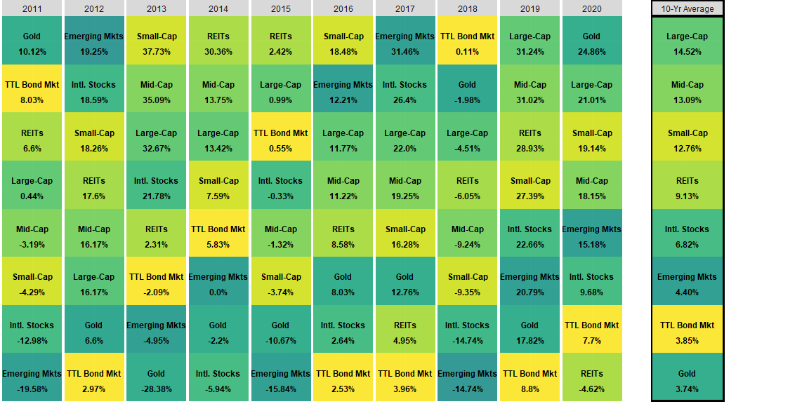

```r
library(tidyverse) #Used for data wrangling and visualization
library(tidyquant) #Get Stock data
library(lubridate) #Deals with dates
library(gridExtra) #Combine multiple plots
library(viridis)   #For coloring the plot
```


```r
# Large Cap Index Returns - VV
# Mid Cap Index Returns - VO
# Small Cap Index Returns - VB
# Real Estate Index Returns - VNQ
# Emerging Markets Index Returns - VWO
# Developing Markets Index Returns - VEA
# Gold Returns - GLD
# Total Bond Market - BND

#Get Stock prices from Yahoo Finance

prices <- c("VV", 'VO', 'VB', 'VNQ', 'VWO', 'VEA', 'GLD', 'BND') %>%
  tq_get(get  = "stock.prices",
         from = "2011-01-01",
         to   = "2021-01-01")
```


```r
graph <- function(year) {
  returns_yearly <- prices %>%
    group_by(symbol) %>%
    tq_transmute(select     = adjusted, 
                 mutate_fun = periodReturn, 
                 period     = "yearly", 
                 col_rename = "Returns") %>% 
    mutate(Year = year(date)) %>% 
    group_by(Year, symbol) %>% 
    arrange(Year, Returns) %>% 
    filter(Year == year) %>% 
    mutate(symbol = case_when(
      symbol == 'VV' ~ 'Large-Cap',
      symbol == 'VO' ~ 'Mid-Cap',
      symbol == 'VB' ~ 'Small-Cap',
      symbol == 'VWO' ~ 'Emerging Mkts',
      symbol == 'VEA' ~ 'Intl. Stocks',
      symbol == 'GLD' ~ 'Gold',
      symbol == 'VNQ' ~ 'REITs',
      symbol == 'BND' ~ 'TTL Bond Mkt'),
      Year = as.factor(Year), symbol = as.factor(symbol), Returns = scales::percent(Returns, accuracy = .11))
  
  #Reorders the levels of the symbols so that the with the greatest return appears at the top of the plot
  returns_yearly$symbol <- factor(returns_yearly$symbol, levels = returns_yearly$symbol)
  
  #Creates return plots for years 2010 - 2020.
  ggplot(returns_yearly, aes(x = Year, y = symbol, fill = symbol)) +
    geom_tile() + 
    geom_text(data = returns_yearly, aes(x = Year, y = symbol, label = symbol, vjust = -.2, fontface = 'bold'), size =3.25) +
    geom_text(aes(fill = Returns, label = returns_yearly$Returns, vjust = 2, fontface = 'bold'), size =3.25) +
    facet_wrap(~Year, scales = 'free') +
    scale_fill_viridis(discrete = TRUE, alpha = .9) +
    scale_y_discrete(expand = c(0, 0)) +
    scale_x_discrete(expand = c(0, 0)) +
    theme(axis.text.y = element_blank(),
          axis.title.y = element_blank(),
          axis.ticks.y = element_blank(),
          axis.title.x = element_blank(),
          axis.text.x = element_blank(),
          axis.ticks.x = element_blank(),
          legend.position = "none",
          plot.margin = rep(unit(0,"null"),4),
          panel.margin = unit(0,"null"))
}
```


```r
#Averages the asset class returns from 2011 - 2020
returns_yearly_avg <- prices %>%
  group_by(symbol) %>%
  tq_transmute(select     = adjusted, 
               mutate_fun = periodReturn, 
               period     = "yearly", 
               col_rename = "Returns") %>% 
  ungroup() %>% 
  group_by(symbol) %>% 
  summarize(Averages = mean(Returns)) %>% 
  arrange(Averages) %>% 
  mutate(symbol = case_when(
    symbol == 'VV' ~ 'Large-Cap',
    symbol == 'VO' ~ 'Mid-Cap',
    symbol == 'VB' ~ 'Small-Cap',
    symbol == 'VWO' ~ 'Emerging Mkts',
    symbol == 'VEA' ~ 'Intl. Stocks',
    symbol == 'GLD' ~ 'Gold',
    symbol == "VNQ" ~ "REITs",
    symbol == 'BND' ~ 'TTL Bond Mkt')
    ,`10-Yr Average` = '10-Yr Average', Year = as.factor(`10-Yr Average`), symbol = as.factor(symbol), Averages = scales::percent(Averages, accuracy = .11))

#Reorders the levels of the symbols so that the with the greatest return appears at the top of the plot
returns_yearly_avg$symbol <- factor(returns_yearly_avg$symbol, levels = returns_yearly_avg$symbol)

# Creates a 10-Year Average plot
averages_plot <- ggplot(returns_yearly_avg, aes(x = `10-Yr Average`, y = symbol, fill = symbol)) +
  geom_tile() + 
  geom_text(data = returns_yearly_avg, aes(x = `10-Yr Average`, y = symbol, label = symbol, vjust = -.2, fontface = 'bold'), size = 3.25) +
  geom_text(aes(fill = Averages, label = Averages, vjust = 2, fontface = 'bold'), size =3.25) +
  facet_wrap(~`10-Yr Average`, scales = 'free') +
  scale_fill_viridis(discrete = TRUE, alpha = .9) +
  scale_y_discrete(expand = c(0, 0)) +
  scale_x_discrete(expand = c(0, 0)) +
  theme(axis.text.y = element_blank(),
        axis.title.y = element_blank(),
        axis.ticks.y = element_blank(),
        axis.title.x = element_blank(),
        axis.text.x = element_blank(),
        axis.ticks.x = element_blank(),
        plot.margin = unit(c(0, -1.5, 0, 1), "cm"),
        legend.position = "none",
        panel.border = element_rect(colour = "black", fill=NA, size=1.5),
        strip.background = element_rect(color = "black", size = 1.5))
```


```r
#Combines all plots.
grid.arrange(graph(2011), graph(2012), graph(2013), graph(2014), graph(2015), 
             graph(2016), graph(2017), graph(2018), graph(2019), graph(2020), averages_plot, ncol=13)
```

<!-- -->
