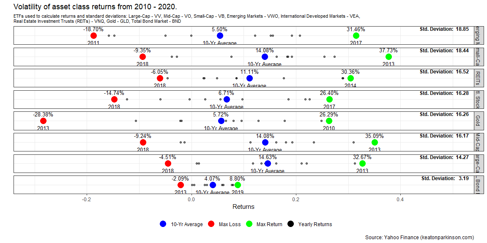

```r
library(tidyverse) #Used for data wrangling and visualization
library(tidyquant) #Get Stock data
library(lubridate) #Deals with dates
library(viridis)  #For coloring the plot
```


```r
#Get Stock prices from Yahoo Finance
prices <- c("VV", 'VO', 'VB', 'VNQ', 'VWO', 'VEA', 'GLD', 'BND') %>%
  tq_get(get  = "stock.prices",
         from = "2010-01-01",
         to   = "2021-01-01") %>% 
  mutate(symbol = case_when(
    symbol == 'VV' ~ 'Large-Cap',
    symbol == 'VO' ~ 'Mid-Cap',
    symbol == 'VB' ~ 'Small-Cap',
    symbol == 'VWO' ~ 'Emerging Mkts',
    symbol == 'VEA' ~ 'Intl. Stocks',
    symbol == 'GLD' ~ 'Gold',
    symbol == 'VNQ' ~ 'REITs',
    symbol == 'BND' ~ 'TTL Bond Mkt'))
```


```r
# Annualized Standard Deviations
annualized_sd <- prices %>% 
  group_by(symbol) %>%
  tq_transmute(select     = adjusted, 
               mutate_fun = periodReturn, 
               period     = "monthly", 
               col_rename = "Returns") %>% 
  summarize(annualized_sd = (sd(Returns) * sqrt(12)) * 100) %>% 
  arrange(desc(annualized_sd))

#Reorders the levels of the symbols so that the with the greatest standard deviation appears at the top of the plot
annualized_sd$symbol <- factor(annualized_sd$symbol, levels = annualized_sd$symbol)

# Yearly Returns
returns_weekly <- prices %>% 
  group_by(symbol) %>%
  tq_transmute(select     = adjusted, 
               mutate_fun = periodReturn, 
               period     = "yearly", 
               col_rename = "Returns") %>% 
  filter(Returns != max(Returns), Returns != min(Returns)) %>% 
  mutate(year = year(date), other_years = 'Yearly Returns')

#Reorders the levels of the symbols so that the with the greatest standard deviation appears at the top of the plot
returns_weekly$symbol <- factor(returns_weekly$symbol, levels = annualized_sd$symbol)

# Find the max yearly returns
returns_weekly_max <- prices %>% 
  group_by(symbol) %>% 
  tq_transmute(select     = adjusted, 
               mutate_fun = periodReturn, 
               period     = "yearly", 
               col_rename = "Returns") %>% 
  mutate(year = year(date)) %>% 
  summarize(max = max(Returns))

# Get the year for max yearly returns
returns_weekly_max_yr <- prices %>% 
  group_by(symbol) %>% 
  tq_transmute(select     = adjusted, 
               mutate_fun = periodReturn, 
               period     = "yearly", 
               col_rename = "Returns") %>% 
  mutate(year = year(date), max = Returns)

# Create a dataset that contains the max returns for the asset class and the year it happens
max_year <- inner_join(returns_weekly_max, returns_weekly_max_yr, by = c('symbol', 'max')) %>% 
  select(symbol, max, year) %>% 
  mutate(Max = 'Max Return')

#Reorders the levels of the symbols so that the with the greatest standard deviation appears at the top of the plot
max_year$symbol <- factor(max_year$symbol, levels = annualized_sd$symbol)

# Find the min yearly returns
returns_weekly_min <- prices %>% 
  group_by(symbol) %>%
  tq_transmute(select     = adjusted, 
               mutate_fun = periodReturn, 
               period     = "yearly", 
               col_rename = "Returns") %>% 
  summarize(min = min(Returns))

# Get the year for min yearly returns
returns_weekly_min_yr <- prices %>% 
  group_by(symbol) %>%
  tq_transmute(select     = adjusted, 
               mutate_fun = periodReturn, 
               period     = "yearly", 
               col_rename = "Returns") %>% 
  mutate(year = year(date), min = Returns)  

# Create a dataset that contains the min returns for the asset class and the year it happens
min_year <- inner_join(returns_weekly_min, returns_weekly_min_yr, by = c('symbol', 'min')) %>% 
  select(symbol, min, year) %>% 
  mutate(Min = 'Max Loss')

#Reorders the levels of the symbols so that the with the greatest standard deviation appears at the top of the plot
min_year$symbol <- factor(min_year$symbol, levels = annualized_sd$symbol)

returns_weekly_average <- prices %>% 
  group_by(symbol) %>%
  tq_transmute(select     = adjusted, 
               mutate_fun = periodReturn, 
               period     = "yearly", 
               col_rename = "Returns") %>% 
  summarize(Average = mean(Returns)) %>% 
  mutate(Averages = '10-Yr Average')

#Reorders the levels of the symbols so that the with the greatest standard deviation appears at the top of the plot
returns_weekly_average$symbol <- factor(returns_weekly_average$symbol, levels = annualized_sd$symbol)
```


```r
# Creates the ggplot
ggplot() +
  geom_point(returns_weekly, mapping = aes(x = '', y = Returns, color = other_years), alpha = .5) +
  geom_point(max_year, mapping = aes(x = '', y = max, color = Max), size = 5) +
  geom_text(max_year, mapping = aes(x = '', y = max, label = year), vjust = 2, size = 3.5) +
  geom_text(max_year, mapping = aes(x = '', y = max, label = scales::percent(max, .11)), vjust = -1, size = 3.5) +
  geom_point(min_year, mapping = aes(x = '', y = min, color = Min), size = 5) +
  geom_text(min_year, mapping = aes(x = '', y = min, label = year), vjust = 2, size =3.5) +
  geom_text(min_year, mapping = aes(x = '', y = min, label = scales::percent(min, .11)), vjust = -1, size = 3.5) +
  geom_point(returns_weekly_average, mapping = aes(x = '', y = Average, color = Averages), size = 5) +
  geom_text(returns_weekly_average, mapping = aes(x = '', y = Average, label = '10-Yr Average'), vjust = 2, size = 3.5) +
  geom_text(returns_weekly_average, mapping = aes(x = '', y = Average, label = scales::percent(Average, .11)), vjust = -1, size = 3.5) +
  geom_text(mapping = aes(x = +Inf, y = +Inf, label = paste('Std. Deviation: ', format(round(annualized_sd, 2), nsmall = 2))), data = annualized_sd, hjust= 1.1,
            vjust   = 1, size = 3.25, fontface = 'bold') +
  ylim(-.3, .5) +
  coord_flip() +
  labs(x = '', title = 'Volatility of asset class returns from 2010 - 2020.', subtitle = 'ETFs used to calculate returns and standard deviations: Large-Cap - VV, Mid-Cap - VO, Small-Cap - VB, Emerging Markets - VWO, International Developed Markets - VEA,\nReal Estate Investment Trusts (REITs) - VNQ, Gold - GLD, Total Bond Market - BND', 
       caption= 'Source: Yahoo Finance (keatonparkinson.com)') +
  scale_color_manual(values = c('blue1', 'red1', 'green1', 'black')) +
  facet_grid(rows = vars(symbol)) +
  theme(strip.text.y.left = element_text(angle = 0)) +
  theme_bw() +
  theme(legend.position = "bottom",
        legend.title = element_blank(),
        axis.ticks.y = element_blank(),
        plot.subtitle = element_text(size = 8))
```

<!-- -->

